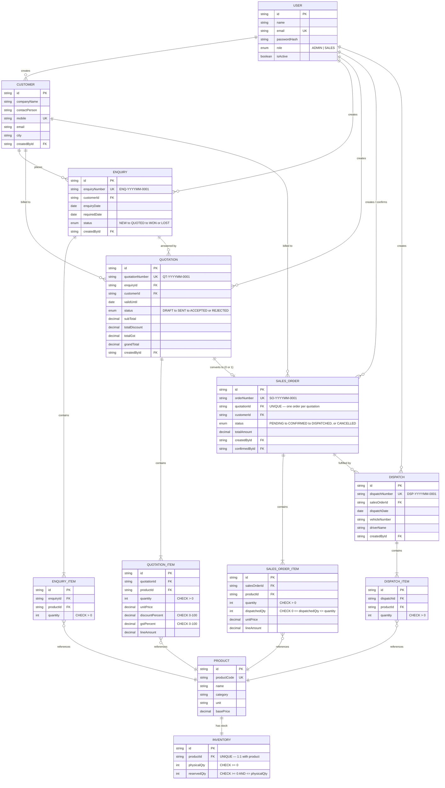

# Database Schema — ER Diagram

Eleven tables model the workflow end to end:

```
Customer → Enquiry → Quotation → Sales Order → Dispatch
```

Every document (Enquiry, Quotation, Sales Order, Dispatch) has its own line
items in a separate table — never JSON — so the relationships are queryable
and enforceable by the database, not just by application code.



There is a twelfth table, `document_sequences`, not shown above because it
carries no foreign keys — it just hands out `ENQ-`/`QT-`/`SO-`/`DSP-` numbers.
See the note at the bottom of this page.

---

## Why each table exists, and one decision per table worth explaining

### `users`

Two roles only: `ADMIN` and `SALES`. Role is stored on the user, re-read from
the database on every request (not trusted from the JWT payload alone), so a
role change or deactivation takes effect on the very next request rather than
waiting for the token to expire.

### `customers`

`mobile` is `UNIQUE`. This business identifies a customer by phone number, so
the uniqueness is enforced by the database — two concurrent "create customer"
requests for the same number cannot both succeed, the same pattern used
everywhere numbering and reservation need to be race-proof.

### `products` + `inventory` — the one-to-one split, and the missing column

`inventory` is a separate table from `products`, in a strict 1:1 relationship
(`inventory.productId` is `UNIQUE`), rather than `physicalQty`/`reservedQty`
columns bolted onto `products`. Splitting them keeps the frequently-written
stock numbers away from the rarely-written product master, and makes the
"every product has exactly one inventory row" invariant a schema fact instead
of an application convention.

**There is no `availableQty` column.** Available stock is always
`physicalQty − reservedQty`, computed in exactly one function
(`backend/src/modules/inventory/availability.ts`) and never stored. A stored
`availableQty` would be a third number that can disagree with the other two,
with nothing in the schema to say which is authoritative — deriving it makes
that disagreement impossible. This is also the file to touch first for the
live verification round's likely "add `damagedQty`" change: add the column,
subtract it in this one function, and every caller is correct immediately.

### `enquiries` / `enquiry_items`

An enquiry's products live in their own table (`enquiry_items`), one row per
product, with a `UNIQUE (enquiryId, productId)` index — not a JSON array on
the enquiry. This is what the brief explicitly asks for: a relational model a
reviewer can query and constrain, not a document store wearing a SQL costume.
The same pattern repeats for quotations, sales orders and dispatches.

### `quotations` / `quotation_items`

Every money column (`subTotal`, `totalDiscount`, `totalGst`, `grandTotal`,
`unitPrice`, `lineAmount`) is `Decimal(12,2)`, never `Float` — floating point
cannot represent `0.1` exactly, and that error compounds across quotation
lines. `unitPrice` is copied onto the line at creation time rather than
looked up live from `products.basePrice` on every read: a quotation is a
historical document, and editing a product's price later must not silently
rewrite what a customer already agreed to.

### `sales_orders` / `sales_order_items` — the two constraints that carry the business logic

- `sales_orders.quotationId` is `UNIQUE`. This is what actually prevents one
  quotation from producing two sales orders — see point 2 in the main
  README's "How the business rules are enforced" section.
- `sales_order_items.dispatchedQty` tracks how much of each line has already
  shipped, with a `CHECK (dispatchedQty >= 0 AND dispatchedQty <= quantity)`.
  A dispatch is only ever allowed for `quantity - dispatchedQty`, which is
  what makes dispatching the same quantity twice impossible, and what makes
  **partial dispatch** possible: an order can be shipped in more than one
  trip and only becomes `DISPATCHED` once every line is fully out.

### `dispatches` / `dispatch_items`

The only tables that cause `physicalQty` to fall. Everything upstream of
dispatch only ever moves `reservedQty` — see the `INVENTORY` semantics above.

### `document_sequences`

One row per `(prefix, year-month)`, e.g. `"ENQ-202609"`, holding the last
number issued. A document number is allocated with a single atomic
`INSERT … ON CONFLICT DO UPDATE … RETURNING`, called inside the same
transaction that creates the document. The first transaction to reach a given
key takes a row lock on it; the second blocks until the first commits, then
reads the value the first left behind. A naive `SELECT max(number) + 1` does
not have this property — two concurrent readers can see the same maximum and
derive the same "next" number. See
`backend/src/utils/documentNumber.ts`.

---

## Foreign key policy

Every foreign key from a line item or document to `products`, `customers`,
`enquiries` or `quotations` is `ON DELETE RESTRICT` — a referenced row cannot
be deleted while history points at it. Deletes in this system are soft
(`isActive = false`) for exactly this reason: a quotation, order or dispatch
is a historical record, and deleting the product or customer it names would
either fail loudly (good) or silently corrupt the document (bad). Line-item
tables (`enquiry_items`, `quotation_items`, `sales_order_items`,
`dispatch_items`) cascade from their parent document, since a line item has no
meaning once its document is gone.
